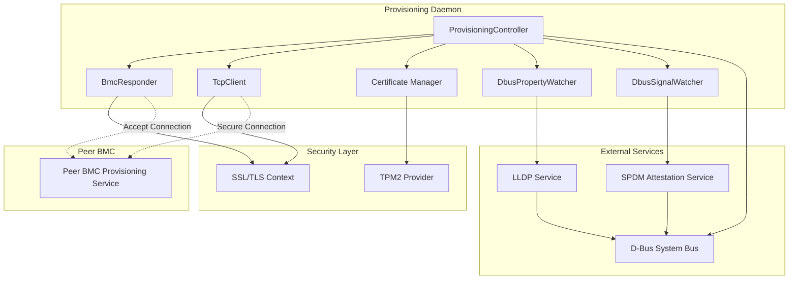
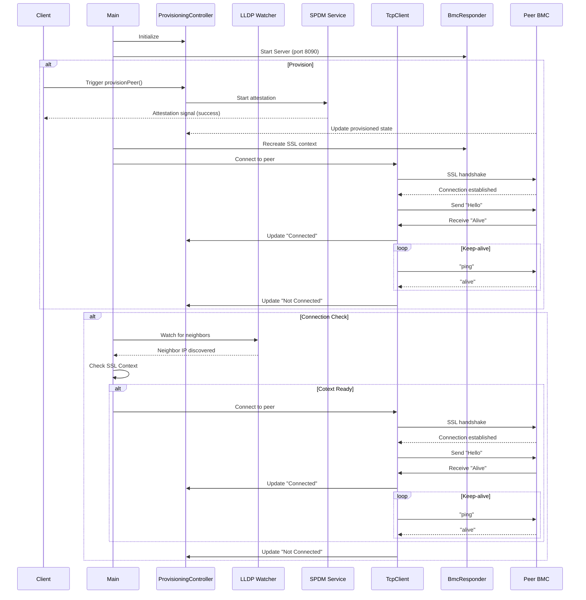
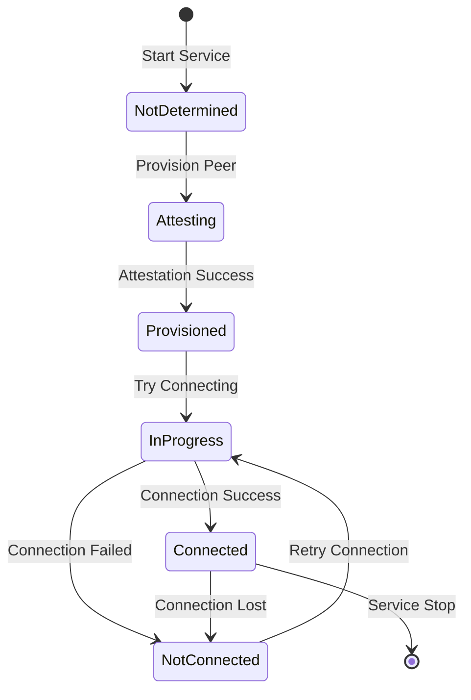
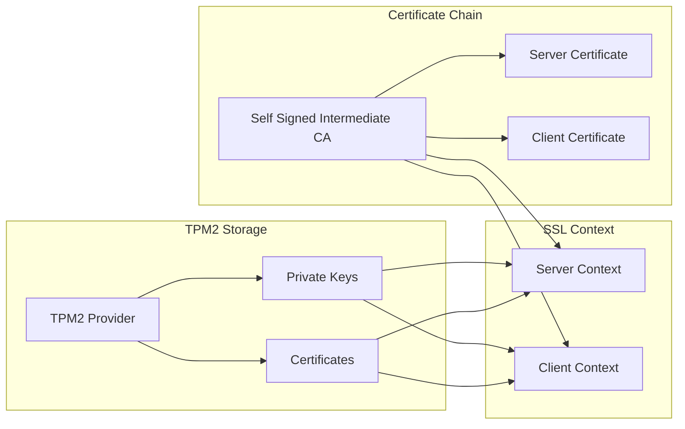

# Provisioning 
## Overview

The Provisioning Daemon (`provisioningd`) is a secure BMC (Baseboard Management Controller) provisioning service that facilitates mutual authentication and secure communication between BMC peers using SPDM (Security Protocol and Data Model) attestation and SSL/TLS encrypted connections.

## Architecture Components

### Core Components

1. **ProvisioningController**
   - Central orchestrator managing provisioning state
   - Exposes D-Bus interface for external control
   - Tracks peer connection status and provisioning state
   - Coordinates between SPDM attestation and secure connections

2. **BmcResponder**
   - SSL/TLS server accepting incoming connections from peer BMCs
   - Handles secure communication after successful provisioning
   - Monitors connection health with keep-alive mechanism
   - Dynamically recreates SSL context after SPDM provisioning

3. **TcpClient**
   - SSL/TLS client for initiating connections to peer BMCs
   - Implements connection retry logic with exponential backoff
   - Performs SSL handshake with mutual authentication
   - Supports timed operations with timeout handling

4. **TcpServer**
   - Generic TCP server template for accepting connections
   - Handles SSL handshake for incoming connections
   - Routes connections to appropriate handlers
   - Manages connection lifecycle

5. **Certificate Management (cert_generator.hpp)**
   - TPM2-based certificate generation and storage
   - X.509 certificate creation and validation
   - Support for CA, intermediate, and leaf certificates
   - PEM/DER format conversion utilities
   - Integration with OpenSSL for cryptographic operations

6. **D-Bus Integration**
   - **DbusPropertyWatcher**: Monitors D-Bus property changes (e.g., LLDP neighbor discovery)
   - **DbusSignalWatcher**: Listens for D-Bus signals (e.g., SPDM attestation completion)
   - Asynchronous D-Bus operations using Boost.Asio coroutines

7. **LLDP Integration**
   - Discovers peer BMC IP addresses via LLDP (Link Layer Discovery Protocol)
   - Monitors network interface for neighbor advertisements
   - Triggers automatic connection attempts when peers are discovered

8. **SPDM Attestation Integration**
   - Interfaces with external SPDM attestation service
   - Initiates device attestation process
   - Waits for attestation completion signals
   - Validates peer identity before establishing trusted connections

## System Architecture



## Component Interactions



## Provisioning Flow



## Security Architecture



## Key Features

### 1. Mutual TLS Authentication
- Both client and server verify peer certificates
- Certificate chain validation against trusted CA
- Support for TPM2-backed private keys
- Modern cipher suites (TLS 1.2+)

### 2. SPDM Integration
- Device attestation before establishing trust
- Integration with external SPDM attestation service
- Asynchronous attestation with timeout handling
- Signal-based notification of attestation completion

### 3. Automatic Peer Discovery
- LLDP-based neighbor discovery
- Automatic connection attempts to discovered peers
- Retry logic with configurable delays
- Connection state tracking

### 4. D-Bus Interface
- Exposes provisioning status via D-Bus
- Allows external control of provisioning process
- Property change notifications
- Signal-based event propagation

### 5. Resilient Connection Management
- Automatic reconnection on connection loss
- Connection health monitoring
- Graceful handling of SSL errors
- Timeout-based operation cancellation

## Configuration

The daemon reads configuration from `/var/provisioning/provisioning.conf`:

```json
{
  "port": 8090,
  "cert_root": "/",
  "interface_id": "eth1"
}
```

### Configuration Parameters

- **port**: TCP port for accepting incoming connections (default: 8090)
- **cert_root**: Root directory for certificate storage (default: "/")
- **interface_id**: Network interface for LLDP monitoring (default: "eth1")


## D-Bus Interface

### Service Name
`xyz.openbmc_project.Provisioning`

### Object Path
`/xyz/openbmc_project/Provisioning`

### Interface
`xyz.openbmc_project.Provisioning.Provisioning`

### Methods
- **provisionPeer(deviceId: string)**: Initiates provisioning for a specific device

### Properties
- **peerConnected**: Connection status (NotDetermined, InProgress, Connected, NotConnected)
- **provisioned**: Boolean indicating if provisioning is complete
## Usage Examples

### Provisioning Commands

To provision self:
```bash
busctl call xyz.openbmc_project.Provisioning /xyz/openbmc_project/Provisioning xyz.openbmc_project.Provisioning.Provisioning ProvisionPeer s self
```

To provision a peer (e.g., skiboards):
```bash
busctl call xyz.openbmc_project.Provisioning /xyz/openbmc_project/Provisioning xyz.openbmc_project.Provisioning.Provisioning ProvisionPeer s skiboards
```

### Checking Provisioning Status

To check if provisioned:
```bash
busctl get-property xyz.openbmc_project.Provisioning /xyz/openbmc_project/Provisioning xyz.openbmc_project.Provisioning.Provisioning provisioned
```

To check peer connection status:
```bash
busctl get-property xyz.openbmc_project.Provisioning /xyz/openbmc_project/Provisioning xyz.openbmc_project.Provisioning.Provisioning peerConnected
```


## Error Handling

### Connection Errors
- SSL handshake failures are logged and trigger reconnection
- Network errors result in connection state updates
- Timeout errors cancel pending operations

### Attestation Errors
- Failed attestation prevents connection establishment
- Timeout during attestation marks peer as not provisioned
- D-Bus communication errors are logged and handled gracefully

## Dependencies

### External Libraries
- **Boost.Asio**: Asynchronous I/O and networking
- **Boost.Beast**: HTTP and WebSocket (if needed)
- **OpenSSL**: SSL/TLS and cryptographic operations
- **sdbusplus**: D-Bus C++ bindings
- **systemd**: Journal logging
- **nlohmann/json**: JSON configuration parsing

### System Services
- **LLDP Service**: `xyz.openbmc_project.LLDP`
- **SPDM Attestation Service**: `xyz.openbmc_project.attestation`
- **D-Bus System Bus**: Inter-process communication

## Threading Model

The daemon uses a single-threaded event loop based on Boost.Asio:
- All I/O operations are asynchronous
- Coroutines (C++20) for sequential async code
- No explicit thread management required
- Thread-safe D-Bus operations via connection sharing

## Performance Considerations

### Connection Pooling
- Single persistent connection per peer
- Connection reuse for multiple operations
- Automatic reconnection on failure

### Timeout Management
- Configurable timeouts for all async operations
- Prevents resource leaks from hung operations
- Graceful cancellation of timed-out operations

### Resource Management
- RAII-based resource cleanup
- Smart pointers for automatic memory management
- Proper cleanup on service shutdown

## Future Enhancements

1. **Multi-peer Support**: Simultaneous connections to multiple peers
2. **Enhanced Monitoring**: Metrics and health checks
