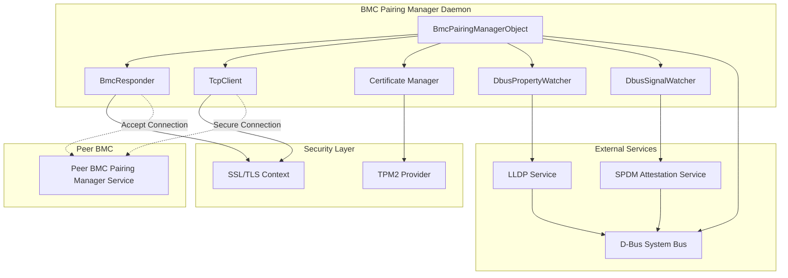
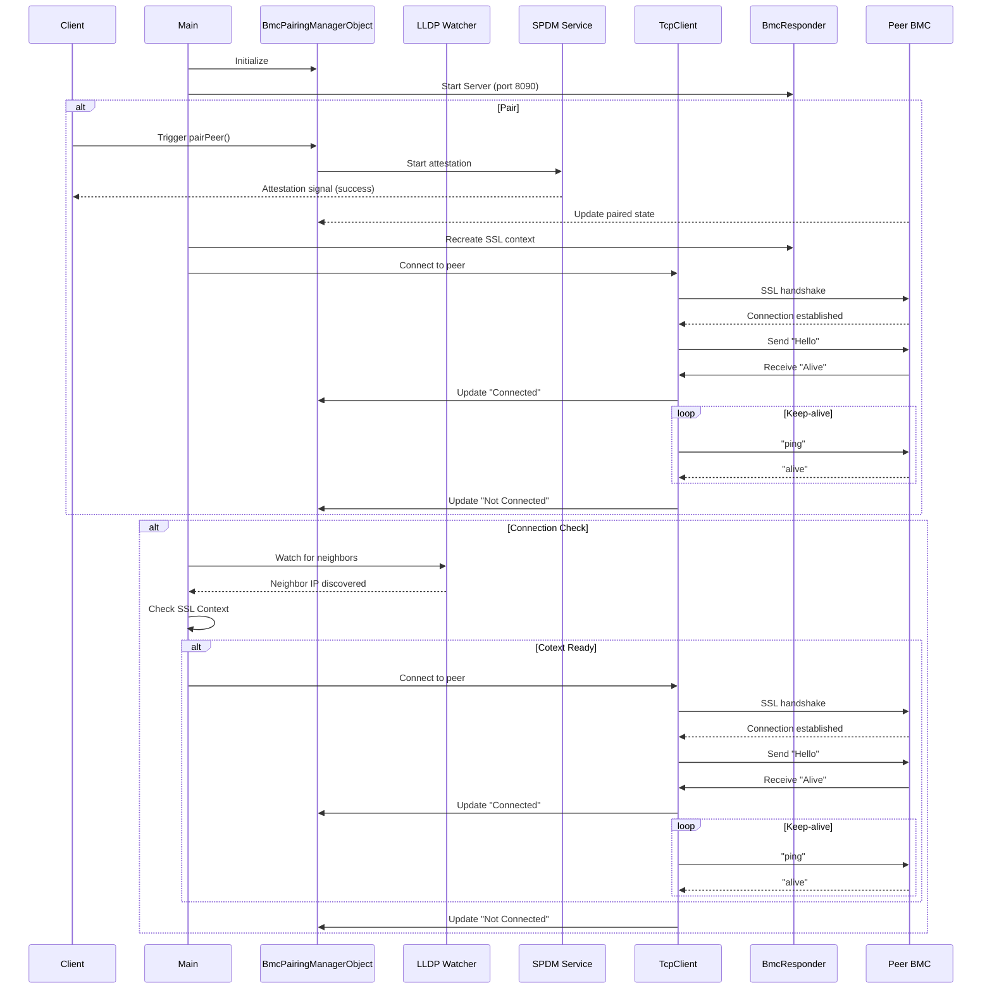
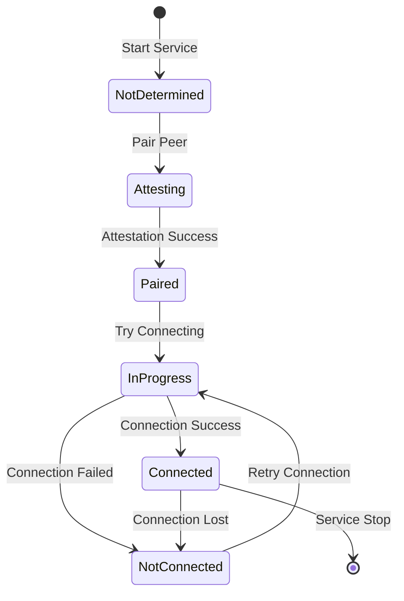
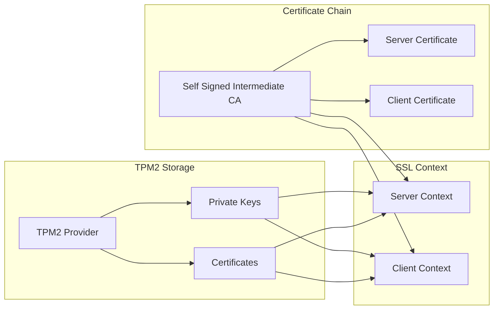

# BMC Pairing Manager
## Overview

The BMC Pairing Manager Daemon (`bmc-pairing-manager`) is a secure BMC (Baseboard Management Controller) pairing service that facilitates mutual authentication and secure communication between BMC peers using SPDM (Security Protocol and Data Model) attestation and SSL/TLS encrypted connections.

## Architecture Components

### Core Components

1. **BmcPairingManagerObject**
   - D-Bus object implementing the Provisioning interface for BMC pairing management
   - Manages provisioning state through PicController integration
   - Tracks bidirectional peer connection status (incoming/outgoing)
   - Provides provisionPeer() method to initiate peer provisioning via D-Bus
   - Exposes provisioned and peerConnected properties for monitoring pairing state
   - Maintains connection state for both incoming (server) and outgoing (client) connections
   - Determines highest connection state across both directions for unified status reporting

2. **BmcResponder**
   - SSL/TLS server accepting incoming connections from peer BMCs
   - Handles secure communication after successful pairing
   - Monitors connection health with keep-alive mechanism
   - Dynamically recreates SSL context after SPDM pairing

3. **TcpClient**
   - SSL/TLS client for initiating connections to peer BMCs
   - Implements connection retry logic with exponential backoff
   - Performs SSL handshake with mutual authentication
   - Supports timed operations with timeout handling

4. **TcpServer**
   - Generic TCP server template for accepting connections
   - Handles SSL handshake for incoming connections
   - Routes connections to appropriate handlers
   - Manages connection lifecycle

5. **Certificate Management (cert_generator.hpp)**
   - TPM2-based certificate generation and storage
   - X.509 certificate creation and validation
   - Support for CA, intermediate, and leaf certificates
   - PEM/DER format conversion utilities
   - Integration with OpenSSL for cryptographic operations

6. **D-Bus Integration**
   - **DbusPropertyWatcher**: Monitors D-Bus property changes (e.g., LLDP neighbor discovery)
   - **DbusSignalWatcher**: Listens for D-Bus signals (e.g., SPDM attestation completion)
   - Asynchronous D-Bus operations using Boost.Asio coroutines

7. **LLDP Integration**
   - Discovers peer BMC IP addresses via LLDP (Link Layer Discovery Protocol)
   - Monitors network interface for neighbor advertisements
   - Triggers automatic connection attempts when peers are discovered

8. **SPDM Attestation Integration**
   - Interfaces with external SPDM attestation service
   - Initiates device attestation process
   - Waits for attestation completion signals
   - Validates peer identity before establishing trusted connections

## System Architecture


```mermaid
graph TB
    subgraph "BMC Pairing Manager Daemon"
        PC[BmcPairingManagerObject]
        BR[BmcResponder]
        TC[TcpClient]
        CM[Certificate Manager]
        DPW[DbusPropertyWatcher]
        DSW[DbusSignalWatcher]
    end
    
    subgraph "External Services"
        LLDP[LLDP Service]
        SPDM[SPDM Attestation Service]
        DBUS[D-Bus System Bus]
    end
    
    subgraph "Security Layer"
        TPM[TPM2 Provider]
        SSL[SSL/TLS Context]
    end
    
    subgraph "Peer BMC"
        PEER[Peer BMC Pairing Manager Service]
    end
    
    PC --> BR
    PC --> TC
    PC --> CM
    PC --> DPW
    PC --> DSW
    
    DPW --> LLDP
    DSW --> SPDM
    PC --> DBUS
    
    CM --> TPM
    BR --> SSL
    TC --> SSL
    
    TC -.->|Secure Connection| PEER
    BR -.->|Accept Connection| PEER
    
    LLDP --> DBUS
    SPDM --> DBUS
```

## Component Interactions


```mermaid
sequenceDiagram
    participant Client
    participant Main
    participant PC as BmcPairingManagerObject
    participant LLDP as LLDP Watcher
    participant SPDM as SPDM Service
    participant TC as TcpClient
    participant BR as BmcResponder
    participant Peer as Peer BMC
    
    Main->>PC: Initialize
    Main->>BR: Start Server (port 8090)

    alt Pair
        Client->>PC: Trigger pairPeer()
        PC->>SPDM: Start attestation
        SPDM-->>Client: Attestation signal (success)
        Peer-->>PC: Update paired state
        Main->>BR: Recreate SSL context
        Main->>TC: Connect to peer
        TC->>Peer: SSL handshake
        Peer-->>TC: Connection established
        TC->>Peer: Send "Hello"
        Peer->>TC: Receive "Alive"

        TC->>PC: Update "Connected"
        loop Keep-alive
            TC->>Peer: "ping"
            Peer-->>TC: "alive"    
        end
        TC->>PC: Update "Not Connected"
    end
   
   
    
    alt Connection Check
        Main->>LLDP: Watch for neighbors
    
        LLDP-->>Main: Neighbor IP discovered
        Main->>Main: Check SSL Context
        alt Cotext Ready
            Main->>TC: Connect to peer
            TC->>Peer: SSL handshake
            Peer-->>TC: Connection established
            TC->>Peer: Send "Hello"
            Peer->>TC: Receive "Alive"
            TC->>PC: Update "Connected"
            loop Keep-alive
                TC->>Peer: "ping"
                Peer-->>TC: "alive"    
            end
        end
        TC->>PC: Update "Not Connected"
    end
    
   
```

## Pairing Flow


```mermaid
stateDiagram-v2
    [*] --> NotDetermined: Start Service
    NotDetermined --> Attesting: Pair Peer
    Attesting --> Paired: Attestation Success
    Paired --> InProgress: Try Connecting
    InProgress --> Connected: Connection Success
    InProgress --> NotConnected: Connection Failed
    Connected --> NotConnected: Connection Lost
    NotConnected --> InProgress: Retry Connection
    Connected --> [*]: Service Stop
```

## Security Architecture


```mermaid
graph LR
    subgraph "Certificate Chain"
        IC[Self Signed Intermediate CA]
        SC[Server Certificate]
        CC[Client Certificate]
    end
    
    subgraph "TPM2 Storage"
        TPM[TPM2 Provider]
        PK[Private Keys]
        CERT[Certificates]
    end
    
    subgraph "SSL Context"
        SCTX[Server Context]
        CCTX[Client Context]
    end
    
   
    IC --> SC
    IC --> CC
    
    TPM --> PK
    TPM --> CERT
    
    PK --> SCTX
    PK --> CCTX
    CERT --> SCTX
    CERT --> CCTX
    IC --> SCTX
    IC --> CCTX
```

## Key Features

### 1. Mutual TLS Authentication
- Both client and server verify peer certificates
- Certificate chain validation against trusted CA
- Support for TPM2-backed private keys
- Modern cipher suites (TLS 1.2+)

### 2. SPDM Integration
- Device attestation before establishing trust
- Integration with external SPDM attestation service
- Asynchronous attestation with timeout handling
- Signal-based notification of attestation completion

### 3. Automatic Peer Discovery
- LLDP-based neighbor discovery
- Automatic connection attempts to discovered peers
- Retry logic with configurable delays
- Connection state tracking

### 4. D-Bus Interface
- Exposes pairing status via D-Bus
- Allows external control of pairing process
- Property change notifications
- Signal-based event propagation

### 5. Resilient Connection Management
- Automatic reconnection on connection loss
- Connection health monitoring
- Graceful handling of SSL errors
- Timeout-based operation cancellation

## Configuration

The daemon reads configuration from `/var/bmc-pairing-manager/bmc-pairing-manager.conf`:

```json
{
  "port": 8090,
  "cert_root": "/",
  "interface_id": "eth1"
}
```

### Configuration Parameters

- **port**: TCP port for accepting incoming connections (default: 8090)
- **cert_root**: Root directory for certificate storage (default: "/")
- **interface_id**: Network interface for LLDP monitoring (default: "eth1")


## D-Bus Interface

### Service Name
`xyz.openbmc_project.BmcPairingManager`

### Object Path
`/xyz/openbmc_project/BmcPairingManager`

### Interface
`xyz.openbmc_project.BmcPairingManager.BmcPairingManager`

### Methods
- **provisionPeer(deviceId: string)**: Initiates pairing for a specific device

### Properties
- **peerConnected**: Connection status (NotDetermined, InProgress, Connected, NotConnected)
- **provisioned**: Boolean indicating if pairing is complete
## Usage Examples

### Pairing Commands

To pair self:
```bash
busctl call xyz.openbmc_project.BmcPairingManager /xyz/openbmc_project/BmcPairingManager xyz.openbmc_project.BmcPairingManager.BmcPairingManager ProvisionPeer s self
```

To pair a peer (e.g., skiboards):
```bash
busctl call xyz.openbmc_project.BmcPairingManager /xyz/openbmc_project/BmcPairingManager xyz.openbmc_project.BmcPairingManager.BmcPairingManager ProvisionPeer s skiboards
```

### Checking Pairing Status

To check if paired:
```bash
busctl get-property xyz.openbmc_project.BmcPairingManager /xyz/openbmc_project/BmcPairingManager xyz.openbmc_project.BmcPairingManager.BmcPairingManager provisioned
```

To check peer connection status:
```bash
busctl get-property xyz.openbmc_project.BmcPairingManager /xyz/openbmc_project/BmcPairingManager xyz.openbmc_project.BmcPairingManager.BmcPairingManager peerConnected
```


## Error Handling

### Connection Errors
- SSL handshake failures are logged and trigger reconnection
- Network errors result in connection state updates
- Timeout errors cancel pending operations

### Attestation Errors
- Failed attestation prevents connection establishment
- Timeout during attestation marks peer as not paired
- D-Bus communication errors are logged and handled gracefully

## Dependencies

### External Libraries
- **Boost.Asio**: Asynchronous I/O and networking
- **Boost.Beast**: HTTP and WebSocket (if needed)
- **OpenSSL**: SSL/TLS and cryptographic operations
- **sdbusplus**: D-Bus C++ bindings
- **systemd**: Journal logging
- **nlohmann/json**: JSON configuration parsing

### System Services
- **LLDP Service**: `xyz.openbmc_project.LLDP`
- **SPDM Attestation Service**: `xyz.openbmc_project.attestation`
- **D-Bus System Bus**: Inter-process communication

## Threading Model

The daemon uses a single-threaded event loop based on Boost.Asio:
- All I/O operations are asynchronous
- Coroutines (C++20) for sequential async code
- No explicit thread management required
- Thread-safe D-Bus operations via connection sharing

## Performance Considerations

### Connection Pooling
- Single persistent connection per peer
- Connection reuse for multiple operations
- Automatic reconnection on failure

### Timeout Management
- Configurable timeouts for all async operations
- Prevents resource leaks from hung operations
- Graceful cancellation of timed-out operations

### Resource Management
- RAII-based resource cleanup
- Smart pointers for automatic memory management
- Proper cleanup on service shutdown

## Future Enhancements

1. **Multi-peer Support**: Simultaneous connections to multiple peers
2. **Enhanced Monitoring**: Metrics and health checks
